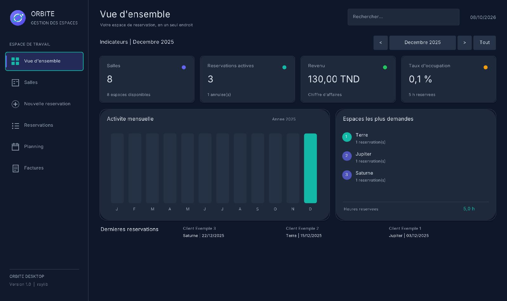
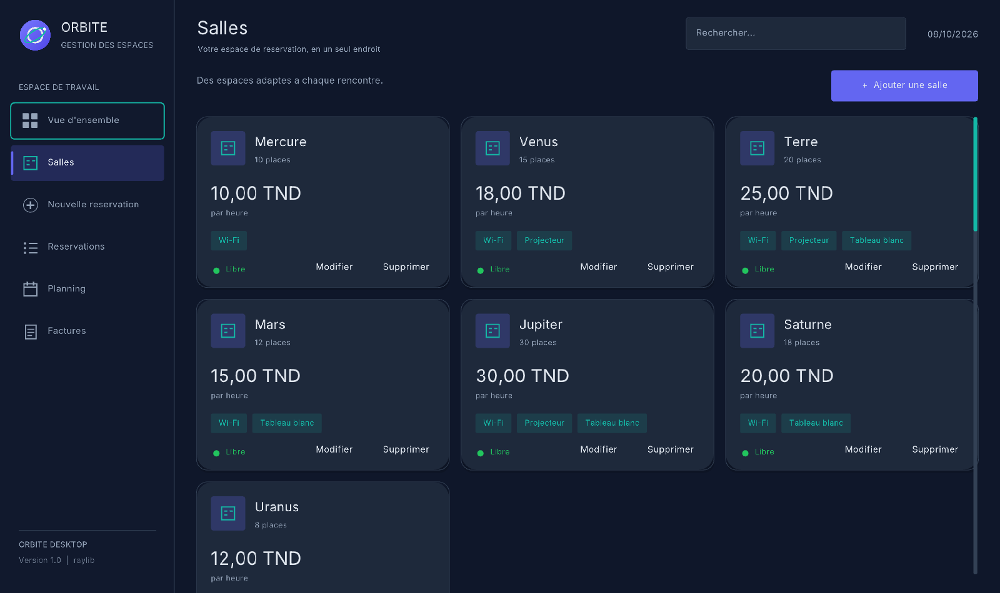
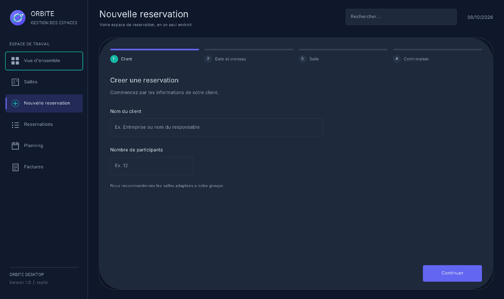
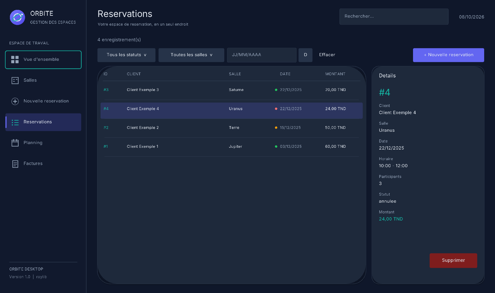
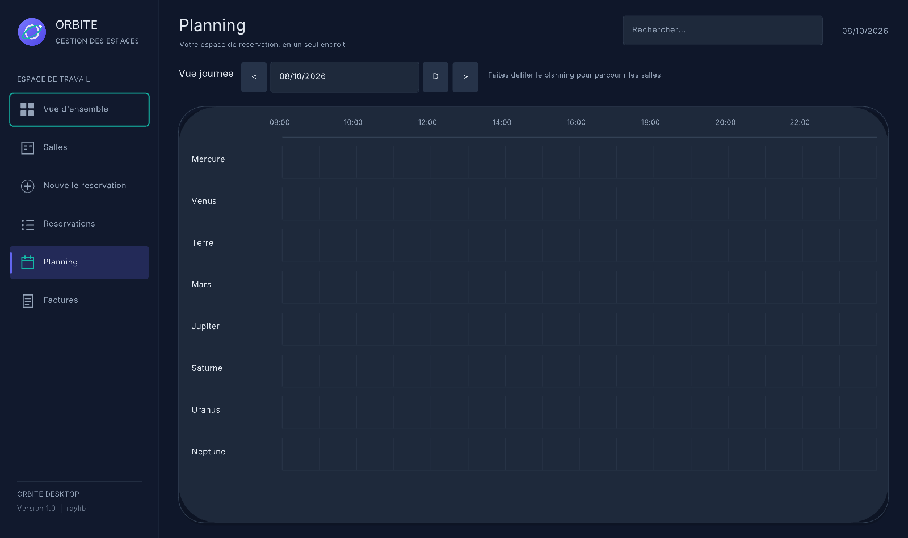
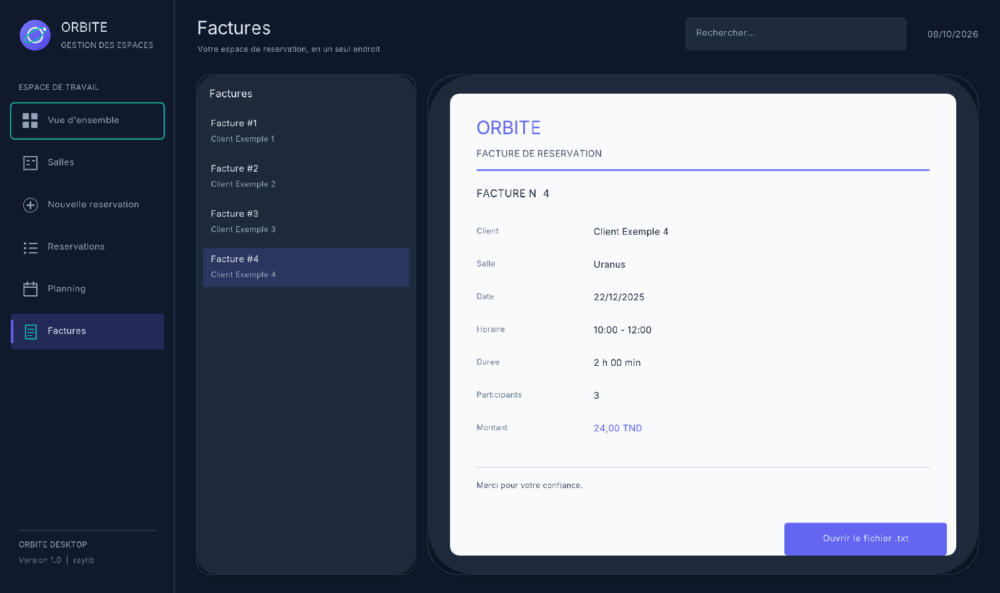

# ORBITE — Gestion des salles et réservations

ORBITE est une application locale en C pour gérer des salles, leurs réservations et les factures associées. Elle comprend une application console et une interface graphique Windows avec raylib. Les deux interfaces partagent le même cœur métier et les mêmes données.

## Captures d’écran

Les captures fournies montrent les six écrans de l'application :













## Démo

▶️ [Voir la vidéo de démonstration](https://drive.google.com/file/d/1OwIY-LzL7hwX98eL-NE560yixGo3Fz8r/view?usp=drive_link)

## Fonctionnalités

- Gestion des salles et de leurs capacités, tarifs horaires et équipements.
- Création, modification, annulation et suppression de réservations.
- Détection des conflits de créneaux et recommandation des salles compatibles.
- Statistiques par période, planning journalier et génération de factures texte.
- Interface console et interface graphique à six écrans : tableau de bord, salles, nouvelle réservation, réservations, planning et factures.

## Règles métier et exemples

- Les créneaux sont compris entre **08:00 et 23:59** ; l'heure de fin doit être postérieure à l'heure de début.
- La capacité disponible et le chevauchement des créneaux sont contrôlés.
- Le montant est égal à la durée réservée multipliée par le tarif horaire de la salle.
- Les statuts persistés comprennent `confirmee`, `modifiee` et `annulee`. Une annulation reste dans l'historique et ne bloque plus son créneau.
- Les identifiants sont attribués à partir du plus grand identifiant existant, plus un.
- La suppression d'une salle ne supprime pas les réservations historiques correspondantes.

Les fichiers de `data/` constituent des exemples fictifs : huit salles, quatre réservations et une facture liée à la réservation 1. Les montants utilisent la virgule comme séparateur décimal.

## Prérequis Windows

- Windows 10/11.
- MSYS2 UCRT64 avec GCC, windres et raylib.
- Le script `build.bat` utilise le chemin MSYS2 par défaut `C:\msys64`.

Dans le terminal **MSYS2 UCRT64**, les dépendances peuvent être installées avec :

```bash
pacman -S --needed mingw-w64-ucrt-x86_64-gcc mingw-w64-ucrt-x86_64-raylib
```

Cette commande est informative : aucune installation n'est effectuée par le projet.

## Compilation et lancement

Depuis PowerShell ou l'invite de commandes, à la racine de ce dépôt :

```bat
build.bat console
build\console.exe
```

Pour compiler et lancer l'interface graphique :

```bat
build.bat gui
executer_orbite.exe
```

La cible graphique utilise `raylib`, `opengl32`, `gdi32` et `winmm`. Le script place les DLL raylib et GLFW nécessaires à côté de l'exécutable localement ; elles ne sont pas suivies par Git.

Les tests automatisés du cœur métier s'exécutent dans un répertoire de données isolé :

```bat
build.bat test
```

## Données persistantes

- `data/Tarif.txt` contient une salle par ligne : nom, capacité, tarif horaire et équipements.
- `data/Reservations.txt` contient les champs d'une réservation séparés par ` | ` : ID, client, salle, date (`JJ/MM/AAAA`), début, fin, nombre de personnes, tarif et statut.
- `data/Facture_<id>.txt` contient la facture textuelle de la réservation correspondante.

Les montants sont écrits avec deux décimales et une virgule. Lancez les applications depuis la racine du dépôt afin que les chemins `data/` soient résolus correctement.

## Architecture

- `src/` — application console, structures, règles métier et persistance.
- `gui/` — interface raylib, widgets, thème et ressources de marque.
- `gui/assets/fonts/` — police Inter et licence OFL incluse.
- `tests/` — tests du cœur métier.
- `data/` — jeu d'exemple fictif et données persistantes.
- `images/captures/` — captures de l'interface graphique.

## Équipe, crédits et licence

**Équipe :** Yasmine Triki, Mohamed Ayedi et Mohamed Louai Darguech.

- [raylib](https://www.raylib.com/) — licence zlib/libpng.
- [Inter](https://github.com/rsms/inter) — licence SIL Open Font License 1.1, fournie dans `gui/assets/fonts/LICENSE.txt`.

**Licence du projet : licence à définir.**

## Limites

- L'application et ses données sont locales ; aucune synchronisation réseau ou base de données distante n'est incluse.
- Les captures sont des démonstrations statiques de l'interface.
